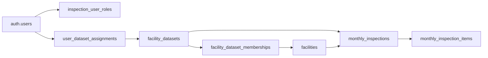

# 시설정보 데이터셋 사용자화 — 1차 개발 플랜

## 1. 목표와 원칙

- 시스템관리자가 `/admin/upload`로 올린 JSON 파일을 **데이터셋 단위**로 관리합니다.
- 사용자별로 할당된 데이터셋의 시설정보만 조회·점검·수정·삭제하도록 보안 격리를 적용합니다.
- 기존 시설목록·월간점검·이력·등록/수정/삭제 동작은 **최대한 그대로** 유지하고, 변경 표면을 좁혀 회귀 위험을 줄입니다.
- **구조안 A**(전역 시설 1행 + 데이터셋 M:N 멤버십 + 월간점검 `dataset_id`) 그대로 따라갑니다. 상세 근거는 [docs/시설정보 사용자화.md](docs/시설정보%20사용자화.md) §3, §6, §11.

## 2. 1차 정책 결정 (사용자 확정)

- **활성 데이터셋 정책**: 전역 "현재 활성 데이터셋" 개념을 두지 않습니다.
  - 조회 화면(시설 목록, 점검 이력, 대시보드)은 사용자가 할당받은 **전체 데이터셋 합집합**으로 표시합니다.
  - 신규 점검 생성 폼에서만 `dataset_id`를 선택합니다. 할당 1건이면 자동 선택, 2건 이상이면 필수 선택입니다.
  - 신규 점검 폼의 시설 검색은 선택된 데이터셋의 **활성 멤버십 + `facilities.is_active=true`** 시설로 한정합니다.
  - 상단 헤더/사이드바 데이터셋 전환기, 조회 화면 데이터셋 탭은 1차 범위에서 제외합니다.
- **비활성 시설 정책**: 별도 화면 없이 `facilities.is_active`를 운영 기준으로 사용합니다.
  - JSON 업로드 시 누락된 시설은 해당 데이터셋의 **멤버십을 `is_active=false`로 비활성**하고, 그 결과 **활성 멤버십이 0건**이 되면 글로벌 `facilities.is_active`도 `false`로 자동 전이합니다(트리거 또는 액션 후 보정 쿼리).
  - JSON에 다시 포함되면 멤버십과 글로벌 모두 `true`로 복구합니다.
  - 시설 목록과 신규 점검 대상은 `is_active=true`만 표시합니다.
  - 과거 점검 이력·대장은 비활성 시설도 조회 가능합니다(물리 삭제 금지).
- **데이터셋 archived**: hard delete 대신 `status='archived'`로 처리하고 신규 업로드·신규 점검 생성을 거부합니다.

## 3. 데이터 모델 (1차 in-scope)



- `facility_datasets`: id, name, description, source_file, uploaded_by, facility_count, status(`active|archived`), created/updated_at.
- `facility_dataset_memberships`: `(facility_no, dataset_id) UNIQUE`, is_active, FK CASCADE.
- `user_dataset_assignments`: `(user_id, dataset_id) UNIQUE`, assigned_by, created_at.
- `monthly_inspections.dataset_id`: 컬럼 추가 → 백필 → `NOT NULL` 전환 → 기존 `UNIQUE(facility_no, inspection_month)`를 `(facility_no, inspection_month, dataset_id)`로 교체.
- `facilities.dataset_id`는 **추가하지 않습니다**. 멤버십이 단일 진실 원천입니다.

## 4. 단계별 구현 로드맵

순서는 [docs/시설정보 사용자화.md](docs/시설정보%20사용자화.md) §10을 따르되, 1차 정책에 맞게 조정합니다.
**Phase 0 백업이 모두 완료되고 산출물이 문서화된 뒤에만 Phase 1 이후를 시작합니다.**

### Phase 0 — 현재 상태 백업 (선행 필수, ~30분)

이번 작업은 DB 마이그레이션과 RLS 변경을 포함하므로 코드 백업만으로는 부족합니다. 코드와 DB 양쪽 모두 현재 상태로 복원 가능해야 합니다. Supabase CLI v2.78.1과 supabase 프로젝트 ref `hliykvfxldohkxnizxpy`(저장소 `.cursor/rules/supabase-mcp-project.mdc` 기준, MCP/CLI link 일치 확인 필요)을 사용합니다.

#### 0-1. 프로젝트 폴더 백업

- 대상: `/Users/eugene/Documents/inspect/`
- 백업 위치(예): `~/Documents/safeplay_backup_before_dataset_customization_2026-05-27/`
- 제외: `node_modules`, `.next`, `.vercel`, `.playwright-mcp`
- 필수 보존: `.env.local`, `src/`, `supabase/`, `package.json`, `package-lock.json`, `docs/`, `.git/`(브랜치/이력 보존)
- 명령 예:

```bash
rsync -av \
  --exclude node_modules --exclude .next --exclude .vercel --exclude .playwright-mcp \
  /Users/eugene/Documents/inspect/ \
  ~/Documents/safeplay_backup_before_dataset_customization_2026-05-27/
```

#### 0-2. Supabase DB 백업 (스키마 + 데이터 + 역할/RLS)

- 백업 폴더(예): `~/Documents/safeplay_db_backups/`
- 산출물 3종 분리(스키마/데이터/역할) — 단일 파일보다 복원 단위가 명확해집니다.
- `--linked` 사용 전 `npx supabase projects list`와 `.env.local`의 `NEXT_PUBLIC_SUPABASE_URL`이 `hliykvfxldohkxnizxpy`로 일치하는지 확인합니다.

```bash
mkdir -p ~/Documents/safeplay_db_backups
cd ~/Documents/safeplay_db_backups

# 1) 스키마 (테이블/RLS/함수/트리거/인덱스/제약조건)
supabase db dump --linked \
  -f db_backup_schema_before_dataset_customization_2026-05-27.sql

# 2) 데이터 (COPY)
supabase db dump --linked --data-only --use-copy \
  -f db_backup_data_before_dataset_customization_2026-05-27.sql

# 3) 역할/grant (선택)
supabase db dump --linked --role-only \
  -f db_backup_roles_before_dataset_customization_2026-05-27.sql
```

대안: Supabase Dashboard → Project Settings → Database → Backups에서 manual backup 생성도 함께 권장합니다(플랫폼 측 PITR과 별개로 다운로드 보관).

#### 0-3. 백업 산출물 검증

- 각 SQL 파일의 라인 수 > 0, head/tail로 `CREATE TABLE`/`COPY` 시작·종료 라인 확인.
- `shasum -a 256 *.sql` 결과를 기록.
- 프로젝트 폴더 백업본에서 `du -sh`, 파일 개수, `.env.local`·`supabase/migrations/` 존재 확인.

#### 0-4. 백업 위치·복구 절차 문서화

`docs/backups/2026-05-27-dataset-customization.md`(신규)에 다음을 기록:

- 백업 수행자, 수행 시각, Supabase project ref, CLI 버전.
- 프로젝트 백업 절대경로, 크기, 주요 보존 항목 체크리스트.
- DB dump 파일 절대경로, 크기, sha256.
- 복구 절차 명령(아래 0-5 그대로 복사).

`docs/시설정보 사용자화.md` §16 변경 이력에 "Phase 0 백업 완료" 한 줄 추가.

#### 0-5. 복구 절차 (문제 발생 시)

```bash
# A. 코드 복구
mv /Users/eugene/Documents/inspect \
   /Users/eugene/Documents/inspect_failed_$(date +%Y%m%d_%H%M%S)
rsync -av \
  ~/Documents/safeplay_backup_before_dataset_customization_2026-05-27/ \
  /Users/eugene/Documents/inspect/
cd /Users/eugene/Documents/inspect && npm install

# B. DB 복구 — staging 환경에서 사전 검증 권장
# 옵션 1) supabase CLI로 push 된 신규 마이그레이션만 되돌리기
#   supabase migration list --linked        # 마이그레이션 이력 확인
#   supabase migration repair --linked --status reverted <timestamp>  # 필요 시
# 옵션 2) 백업 SQL로 통째 복원 (DB URL은 Supabase Dashboard → Connection string)
psql "$SUPABASE_DB_URL" -f db_backup_schema_before_dataset_customization_2026-05-27.sql
psql "$SUPABASE_DB_URL" -f db_backup_data_before_dataset_customization_2026-05-27.sql
# 옵션 3) 최후 수단 — Dashboard에서 manual backup으로 PITR/restore
```

주의: `supabase db reset --linked`는 **전 데이터 초기화**이므로 사용하지 않습니다(원격 DB 대상이면 데이터 손실).

#### 0-6. 진행 게이트

- 코드 백업, DB dump 3종, 검증 해시, 문서화가 모두 완료된 것을 사용자가 확인한 뒤 Phase 1 마이그레이션 작성을 시작합니다.
- 백업 중 어떤 단계라도 실패하면 즉시 중단하고 보고합니다.

### Phase 1 — DB 스키마 추가 (1~1.5일)

- 마이그레이션 컨벤션: `supabase/migrations/YYYYMMDDHHMMSS_*.sql` (기존 패턴 유지).
- 마이그레이션 파일:
  - `*_facility_datasets.sql`
  - `*_facility_dataset_memberships.sql`
  - `*_user_dataset_assignments.sql`
  - `*_monthly_inspections_dataset_id.sql` (컬럼만 추가, nullable, FK)
- 인덱스: `memberships(dataset_id, is_active)`, `memberships(facility_no)`, `assignments(user_id)`, `monthly_inspections(dataset_id, inspection_month)`.
- 타입 정의(`src/types/database.ts`)는 현재 수동 유지 패턴이므로, 신규 테이블·컬럼 타입을 동일 스타일로 손으로 추가합니다.
- **이 단계에서 RLS는 변경하지 않습니다** (기존 `using (true)` 유지하여 기존 흐름 보존).

### Phase 2 — 기존 데이터 백필 (0.5일)

`*_seed_default_dataset.sql` 하나에 다음을 순서대로 수행합니다.

1. `INSERT INTO facility_datasets` — 이름 `"기존 시설 데이터"`, status `active`.
2. 기존 `facilities` 전체에 대해 `facility_dataset_memberships` 생성 (`is_active = facilities.is_active`).
3. 비-ADMIN 사용자(`inspection_user_roles.role != 'ADMIN'`) 전체에 대해 `user_dataset_assignments` 생성.
4. `monthly_inspections.dataset_id` NULL인 행 일괄 UPDATE.
5. 검증: `monthly_inspections.dataset_id IS NULL = 0`, 멤버십 누락 0, 점검 건수 불변.
6. 이후 `monthly_inspections.dataset_id`에 `NOT NULL` + 새 `UNIQUE(facility_no, inspection_month, dataset_id)` 추가(기존 unique drop).

### Phase 3 — 업로드 흐름 개편 (1.5~2일)

대상 파일:

- [src/app/(dashboard)/admin/upload/upload-form.tsx](src/app/%28dashboard%29/admin/upload/upload-form.tsx)
- [src/app/(dashboard)/admin/upload/actions.ts](src/app/%28dashboard%29/admin/upload/actions.ts)
- [src/lib/json-parser/uploader.ts](src/lib/json-parser/uploader.ts)
- (필요 시) [src/lib/json-parser/mapper.ts](src/lib/json-parser/mapper.ts)

작업 내용:

- UI: "신규 데이터셋 생성" vs "기존 active 데이터셋 선택" 라디오. 신규일 때 이름(필수)·설명(선택) 입력. archived는 선택 목록에 노출하지 않습니다.
- `uploadJsonAction`: `formData.datasetId` 또는 `newDatasetName`을 검증, 신규면 `facility_datasets` insert, 기존이면 `status='active'` 확인.
- `uploadFacilityJson(supabase, payload, { datasetId })` 시그니처 확장. 호출부에서 항상 전달합니다.
- 시설별 처리 순서(현 `uploadFacility` 안에서):
  1. `facilities` upsert (글로벌 마스터, `facility_no` 충돌 시 갱신).
  2. `facility_dataset_memberships` upsert `(facility_no, dataset_id, is_active=true)`.
  3. 기존 equipment/참조 4종 동기화 로직 유지.
- 전체 배열 처리 완료 후:
  - 동일 `dataset_id` 멤버십 중 JSON에 없는 시설 → `UPDATE memberships SET is_active=false`.
  - 영향 받은 facility_no들에 대해 `facilities.is_active` 보정: 활성 멤버십 합집합이 0이면 false, 1개 이상이면 true. (액션에서 일괄 UPDATE 또는 트리거)
  - `facility_datasets`: `facility_count`, `source_file`, `uploaded_by`, `updated_at` 갱신.
- 결과 카드: 데이터셋명/id, 신규/갱신/비활성 시설 수, 멤버십 비활성 수까지 표시.
- 부분 실패 시 일관성 보호를 위해 시설 단위 try/catch는 유지하되, 동기화·보정 단계는 성공한 시설만 대상으로 수행합니다(완전 트랜잭션화는 2차에서 검토).

### Phase 4 — 쓰기 경로 dataset_id 적용 + 조회 보조 필터 (1~1.5일)

#### 4-1. 신규 점검 생성

대상 파일:

- [src/app/(dashboard)/inspections/new/page.tsx](src/app/%28dashboard%29/inspections/new/page.tsx)
- [src/app/(dashboard)/inspections/new/actions.ts](src/app/%28dashboard%29/inspections/new/actions.ts)

작업 내용:

- 서버에서 `user_dataset_assignments` 조회(ADMIN은 모든 active 데이터셋).
- 0건: 폼 비활성 + 안내 메시지. 1건: hidden field로 고정. 2건 이상: select 노출 + `required`.
- 시설 검색 쿼리: `facilities` JOIN `facility_dataset_memberships`(`dataset_id = ?`, `is_active = true`) + `facilities.is_active = true`.
- `createMonthlyInspection`:
  - `dataset_id` 입력 검증(사용자 할당 + active status + 멤버십 활성 + 시설 active).
  - 중복 검사: `(facility_no, inspection_month, dataset_id)` 기준.
  - INSERT에 `dataset_id` 포함. `23505` race 처리는 동일 키 기준으로 변경.
  - equipment 스냅샷 로직은 현행 유지.

#### 4-2. 시설 목록·신규 점검 검색의 is_active 필터

- [src/app/(dashboard)/facilities/facilities-table.tsx](src/app/%28dashboard%29/facilities/facilities-table.tsx)
- 위 검색 쿼리에 `.eq("is_active", true)` 추가(과거 점검 이력/대장 페이지는 그대로 둠).

#### 4-3. 사용자 관리 화면

대상 파일:

- [src/app/(dashboard)/settings/users/page.tsx](src/app/%28dashboard%29/settings/users/page.tsx)
- [src/app/(dashboard)/settings/user-actions.ts](src/app/%28dashboard%29/settings/user-actions.ts)
- [src/lib/auth/helpers.ts](src/lib/auth/helpers.ts) — `getAccessibleDatasetIds(userId)` 추가.

작업 내용:

- 사용자 행에 할당 데이터셋 배지 표시.
- 멀티 셀렉트 또는 체크박스로 `user_dataset_assignments` upsert/delete 액션 추가.
- `createUserAction`은 1차에서 기본 할당 없이 생성 후 별도 할당 UI에서 추가하도록 합니다.
- ADMIN 변경·정지 등 기존 동작은 변경하지 않습니다.

#### 4-4. 점검 이력·대시보드 (조회는 RLS에 위임)

- [src/app/(dashboard)/inspections/history/history-table.tsx](src/app/%28dashboard%29/inspections/history/history-table.tsx), [src/app/(dashboard)/dashboard-content.tsx](src/app/%28dashboard%29/dashboard-content.tsx), [src/components/inspection/monthly-result-realtime-chart.tsx](src/components/inspection/monthly-result-realtime-chart.tsx)는 쿼리 본문을 그대로 두고 Phase 5에서 RLS로 자동 필터링되게 합니다.
- 시설 상세 탭의 `monthly_inspections` 조회도 동일하게 RLS에 의존합니다.
- 점검 [save](src/app/%28dashboard%29/inspections/%5BinspectionId%5D/actions.ts) / 완료 / 삭제 액션은 RLS가 거부하면 자동으로 차단되므로 코드 수정은 최소화합니다.

### Phase 5 — RLS 교체 (1일)

마이그레이션 1개 (`*_rls_dataset_filtering.sql`)에서 일괄 적용합니다.

- 헬퍼 함수: `app_private.user_accessible_dataset_ids()` (ADMIN은 `NULL` 반환 = 전체).
- `facilities` SELECT 정책: ADMIN 통과 또는 활성 멤버십 + 할당 매칭(문서 §4.3).
- `equipment`, `facility_legal_inspections`, `safety_educations`, `liability_insurances`, `facility_managers` SELECT: facility 멤버십 기반 동일 패턴(문서 §4.4).
- `monthly_inspections` SELECT/INSERT/UPDATE/DELETE: ADMIN 또는 `dataset_id ∈ 할당`(문서 §4.5). 기존 삭제·완료 후 수정 정책(`20260525233000`, `20260526120000`)과 AND 조건으로 결합.
- `monthly_inspection_items`, `inspection_ledger_rows`: 부모 inspection 접근 정책 상속.
- 신규 테이블 자체 RLS:
  - `facility_datasets`: ADMIN 전체 / 비ADMIN은 할당된 `id`만 SELECT.
  - `facility_dataset_memberships`: ADMIN 전체 / 비ADMIN은 할당 dataset 범위 SELECT.
  - `user_dataset_assignments`: ADMIN CRUD, 비ADMIN 본인 SELECT.
- 기존 `using (true)` 정책은 `DROP POLICY IF EXISTS`로 제거합니다.

### Phase 6 — 검증·문서화 (1일)

- 역할별 수동 시나리오:
  - ADMIN: 전 데이터셋 조회·생성·수정·삭제.
  - MANAGER/INSPECTOR (할당 1건): 시설/점검이 dataset 범위로 좁혀지는지, 신규 점검 폼 자동 선택 확인.
  - MANAGER/INSPECTOR (할당 2건): 폼에서 dataset 선택 강제, 다른 dataset의 점검 수정·삭제 거부 확인.
  - 미할당 사용자: 시설 0건, 점검 0건, 신규 점검 폼 차단.
- Supabase REST 직접 호출로 RLS 우회 시도 → 거부 확인.
- 동일 `facility_no`를 데이터셋 A/B에 각각 업로드 후 양쪽 멤버십·is_active 확인.
- 같은 월에 같은 시설 점검을 A/B 각각 생성 → 충돌 없이 2건 보존 확인.
- archived 데이터셋 업로드·신규 점검 거부 확인.
- [docs/시설정보 사용자화.md](docs/시설정보%20사용자화.md) §14, §16에 구현 결과·결정 변경사항 갱신.

총 예상: 약 6~7.5일(1인 기준).

## 5. 변경 파일 요약

| 영역 | 파일 |
|------|------|
| 백업 산출물 (Phase 0) | `~/Documents/safeplay_backup_before_dataset_customization_2026-05-27/`, `~/Documents/safeplay_db_backups/db_backup_*_2026-05-27.sql`, 신규 `docs/backups/2026-05-27-dataset-customization.md` |
| DB | `supabase/migrations/` 신규 6~7개 (Phase 1·2·5) |
| 타입 | [src/types/database.ts](src/types/database.ts) |
| 업로드 | [src/lib/json-parser/uploader.ts](src/lib/json-parser/uploader.ts), [src/app/(dashboard)/admin/upload/actions.ts](src/app/%28dashboard%29/admin/upload/actions.ts), [src/app/(dashboard)/admin/upload/upload-form.tsx](src/app/%28dashboard%29/admin/upload/upload-form.tsx) |
| 점검 생성 | [src/app/(dashboard)/inspections/new/page.tsx](src/app/%28dashboard%29/inspections/new/page.tsx), [src/app/(dashboard)/inspections/new/actions.ts](src/app/%28dashboard%29/inspections/new/actions.ts) |
| 시설 목록 | [src/app/(dashboard)/facilities/facilities-table.tsx](src/app/%28dashboard%29/facilities/facilities-table.tsx) (is_active 필터) |
| 사용자 관리 | [src/app/(dashboard)/settings/users/page.tsx](src/app/%28dashboard%29/settings/users/page.tsx), [src/app/(dashboard)/settings/user-actions.ts](src/app/%28dashboard%29/settings/user-actions.ts), 새 `dataset-assignment-section.tsx` 정도 |
| 헬퍼 | [src/lib/auth/helpers.ts](src/lib/auth/helpers.ts) |
| 조회 (코드 무변경, RLS만) | [src/app/(dashboard)/facilities/[facilityNo]/page.tsx](src/app/%28dashboard%29/facilities/%5BfacilityNo%5D/page.tsx), [src/app/(dashboard)/facilities/[facilityNo]/facility-detail-tabs.tsx](src/app/%28dashboard%29/facilities/%5BfacilityNo%5D/facility-detail-tabs.tsx), [src/app/(dashboard)/inspections/history/history-table.tsx](src/app/%28dashboard%29/inspections/history/history-table.tsx), [src/app/(dashboard)/dashboard-content.tsx](src/app/%28dashboard%29/dashboard-content.tsx), [src/components/inspection/monthly-result-realtime-chart.tsx](src/components/inspection/monthly-result-realtime-chart.tsx), [src/app/(dashboard)/inspections/[inspectionId]/actions.ts](src/app/%28dashboard%29/inspections/%5BinspectionId%5D/actions.ts) |

## 6. 위험과 완화

- **백업 누락**: Phase 0가 완료되지 않으면 RLS·UNIQUE 교체 단계에서 데이터 손실 시 복구가 불가능합니다. 코드 백업(rsync) + DB dump 3종 + 해시·문서화가 모두 끝났음을 확인한 뒤 Phase 1에 진입합니다.
- **Supabase project ref 혼선**: MCP/CLI가 다른 프로젝트를 가리키면 백업과 마이그레이션이 엉뚱한 DB에 적용됩니다. 매 단계 시작 전 `.env.local`과 `supabase projects list`로 `hliykvfxldohkxnizxpy` 일치를 확인합니다.
- **업로드 비원자성**: 현 uploader는 시설별 try/catch로 부분 성공 모델이라, 멤버십 동기화 추가 시 일부 시설 실패 → 멤버십 불일치 가능. 1차 완화는 "성공한 시설만 멤버십 갱신" + 실패 카운트를 결과 카드에 노출, 완전한 트랜잭션은 2차로 분리합니다.
- **글로벌 마스터 공유 충돌**: 동일 `facility_no`가 다른 데이터셋에서 업로드되면 마지막 업로드가 시설 기본정보·기구·참조 4종을 덮어씁니다(문서 §6.5). 1차에서는 허용 + 결과 카드 안내문, 운영 문서에 명시. 기관별 분리 저장은 2차 이상.
- **`facilities.is_active` 자동 보정 동시성**: 동시에 여러 업로드가 진행될 때 보정 쿼리가 경합할 수 있음. 1차에서는 업로드 자체가 ADMIN 수동 작업으로 빈도가 낮다고 가정하고 단순 UPDATE로 처리, 필요 시 advisory lock을 2차에 검토합니다.
- **RLS 회귀**: Phase 5에서 일괄 교체하므로, 교체 직전 staging 환경에서 시나리오를 모두 통과한 뒤 production 적용. 롤백용 정책 백업 SQL을 같이 보관합니다.

## 7. 1차 개발 후 추가 개선 사항 (2차 후보)

- `/admin/datasets` 데이터셋 관리 화면: 목록, 상세(멤버십·할당 사용자), archive 토글, 사용자 양방향 할당(문서 §7.2).
- `/admin/facilities/inactive` 비활성 시설 전용 화면 + 사이드바 "데이터 관리" 그룹 정비(문서 §7.5).
- 헤더/사이드바 데이터셋 전환기 + 조회 화면 데이터셋 필터 탭(필요 시).
- 점검 이력·대시보드에 데이터셋별 집계/그룹 표시.
- JSON 업로드 트랜잭션화 또는 staging 테이블 → 검증 후 swap.
- 글로벌 마스터 공유 충돌 완화: `last_upload_dataset_id` 기록, 업로드 시 충돌 경고, 또는 기관별 확장 테이블 분리.
- `supabase gen types` 도입과 CI 자동화로 타입 정의 수동 유지 부담 제거.
- 업로드 이력 테이블(`facility_dataset_uploads`)과 파일 보관 정책.
- 데이터셋·할당 변경 감사 로그.
- archived 데이터셋 보관 정책 및 일괄 정리 도구.
- 점검 알림/리포트 범위에 데이터셋 컨텍스트 반영.
- Realtime 구독 filter에 `dataset_id` 명시 추가하여 불필요 이벤트 감소.